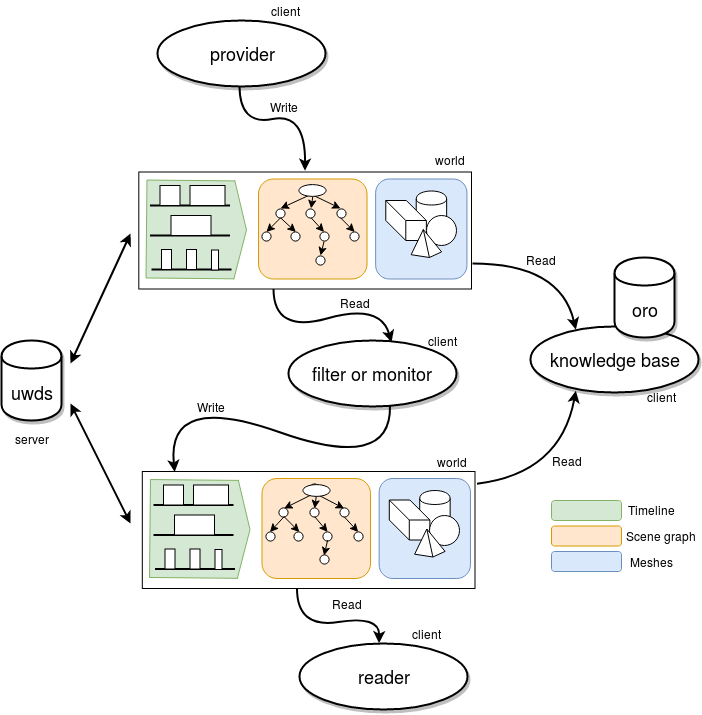
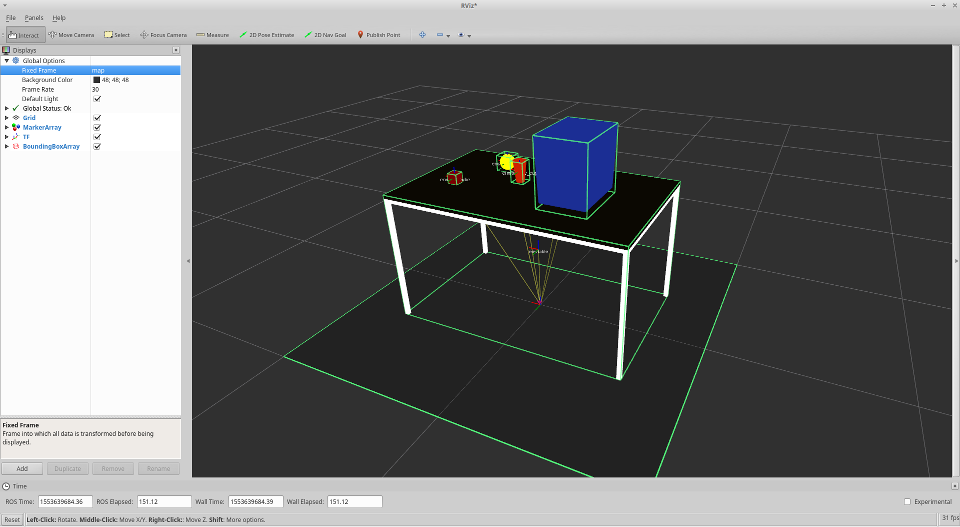
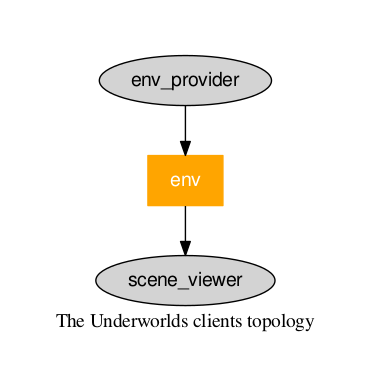
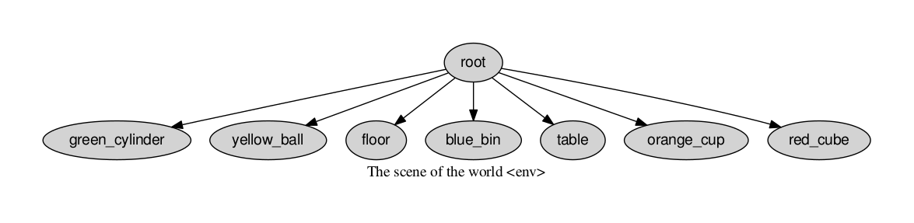

# Underworlds Quick Start
## Introduction

The aim of this quick start guide is to give a basic understanding of what is Underworlds, it’s purpose and it’s applications through basic examples in C++ and Python.  During this guide, we assume that you have a basic understanding of ROS, if it is not the case, follow the [ROS tutorials](https://wiki.ros.org/ROS/Tutorials).

### Core concept

In a classic robotic architecture, the situation assessment component is in charge of generating a set of descriptions in order to give to the robot a comprehension of it's surrounding environment. In the context of human-robot collaborations, the geometry and the relations between agents or objects are particularly important, they allow to ground verbal expressions, perform collaborative task and motion planning or supervise the correct execution of a shared plan.

Underworlds is a framework that focuses on maintaining and distributing multiple/alternative geometric (based on 3D bounding boxes and/or 3D meshes) and symbolic models of the physical world (based on events) over loosely coupled clients that provide reasoning capabilities.

<p align="center">
  
</p>

This architecture allow developers to design high level reasoning in the same modular way than perception pipelines. Allowing to combine dynamically situation-assessment components depending on the task and to implement quickly new geometric and symbolic reasoners.

It can be viewed as a set of distributed world states that share the share data-structure : A scene graph (that is actually a tree) where each node referent his parent with a relative position, velocity and acceleration (with they respective covariances); a timeline of situations (event or temporal predicates that can represent actions or facts for example) and the meshes that are centrally stored and served on-demand.

### Documentation

Documentations can be found here :
* [API Documentation]()
* [MSG Documentation]()

## Installation instructions

First install the dependencies with :
```
sudo apt-get install assimp-utils ros-$ROS_DISTRO-pose-cov-ops ros-$ROS_DISTRO-jsk-recognition-msgs ros-$ROS_DISTRO-jsk-visualization-msgs ros-$ROS_DISTRO-jsk-visualization
sudo pip install pygraphviz uuid
```
Then clone and build the catkin package :
```
cd catkin_ws/src
git clone https://github.com/underworlds-robot/uwds_msgs.git
git clone https://github.com/underworlds-robot/uwds.git
cd ..
catkin_make
source devel/setup.bash
```

Note : A Docker is available [here](https://github.com/underworlds-robot/uwds_dockerfile)

### First launch

First, launch the server with :
```
roslaunch uwds uwds_server.launch
```
Launch the *env_provider* that will create a world from a 3D file :
```
roslaunch uwds env_provider.launch
```
And after that launch the scene viewer that will publish the visualization topics :

```
roslaunch uwds scene_viewer.launch
```

Then start Rviz with :
```
rviz
```
Verify that you have set the global frame of Rviz to `map`. Then add two types of Display, a `BoundingBoxArray`(available in the jsk_visualization package) and a `MarkerArray` display.

Choose the only topic available in each display (it should be respectively `env/boxes` and `env/meshes`).

When you are done, you should have something like this :

<p align="center">
  
</p>

### Introspection

In order to visualize the clients topology, use the following commands :
```
rosrun uwds view_topology.py
evince topology.pdf
```

You should have something like that :

<p align="center">
  
</p>

This figure means that the *env_provider* writes into the world named *env* and the *scene_viewer* reads it.

You can also inspect the scene graph of the visualized world by using :
```
rosrun uwds view_scene.py env
evince scene.pdf
```

This should generate this :

<p align="center">
  
</p>

As you notice, every node is at least parented to the root of the tree. The scene can be viewed in the same manner that the traditional `tf`.

## Build your own clients

In this section you will learn how to make your own clients by using the C++ or the Python Client API. The examples given are simple in order to focus on the core concepts.

### C++ Minimal working examples

#### Provider example

#### Filter example

#### Reader example

### Python Minimal working examples

#### Provider example

#### Filter example

#### Reader example

## Good practices and optimization

### Launch files

### Nodelet-based architecture
