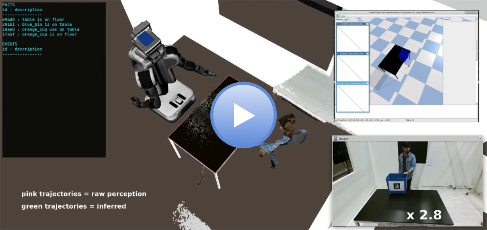
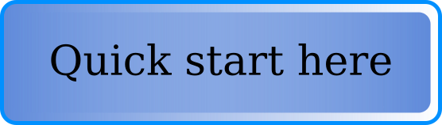

# Underworlds-ROS
This ROS package named ***uwds*** contains the core components of *Underworlds* as a **nodelet based architecture** that benefit from zero-copy pointer passing through topics.

Note : A Python Client API is provided in order to communicate with the server and develop your own clients, but will not benefit from this functionality.

----
<a href="http://www.youtube.com/watch?feature=player_embedded&v=sM5uTl-Klxo" target="blank">

</a>

*Underworlds* is a distributed and lightweight framework that aims at **sharing between clients parallel models of the physical world surrounding a robot**.

The clients can be geometric reasoners (that compute topological relations between objects), motion planner, event monitors, viewers... any software that need to access a geometric (based on 3D meshes/voxels) and/or temporal (based on events) view of the world.

One of the main specific feature of *Underworlds* is the ability to **store many parallel worlds**: past models of the environment, future models, models with some objects filtered out, models that are physically consistent, etc.

This package provide the server that store the data and distribute it on-demand, abstract classes to develop your own clients and a basic set of common clients.

# Clients features

This package comes with a set of clients that allow the robot to have HRI centered features, however the core of Underworlds is domain-agnostic.

Here is the list of clients and they usage:

- **SimpleObjectProvider** : Allow to bind one BoundingBox object detection from [jsk_recognition](https://github.com/jsk-ros-pkg/jsk_recognition) stack.
- **ArObjectProvider** : Allow to use ar_tags for object detection and recognition based on  [ar_track_alvar](https://wiki.ros.org/ar_track_alvar) package.
- **TimelineViewer** : Allow to visualize into Rviz the timelines of the connected worlds by publishing an OverlayText.
- **WorldMerger** : Allow to gather perception data from multiple worlds into one merged world state, this client transform also perception data from sensor frame to global frame.
- **SceneViewer** : Allow to visualize the connected worlds into Rviz by publishing MarkerArray and BoundingBoxArray for each world.
- **EnvProvider** : Allow to load a scene into the given world from an Assimp compatible 3D file.
- **RegexFilter** : Allow to filter the nodes of a scene based on a regex.
- **PhysicsReasoner** : Allow to anchor perception data into a simulation-based physically consistent world where perspective-independent predicates (*isOn(object,object)*, *isIn(object,object)*) are computed on corrected bbox and actions (*Pick(object)*, *Place(object)*, *Release(object)*) are inferred by analyzing physical violations.
- **UwdsKnowledgeBase** : Allow to fetch Underworlds data structure IDs by performing a SPARQL-like query to an external ontology based reasoner that share the same domain than the descriptions computed by the system.
- **UwdsKBLite** : Allow to fetch Underworlds data structure IDs by performing a semantic matching with the Underworlds data-structure and the given NL query, based on global word vector representation.
- **VisibilityMonitor** : Compute the predicate *isVisibleBy(object,camera)* for each camera in the scene by using graphical rendering (offscreen rendering possible).
- **BeliefsFilter** : Allow to infer an estimation of the human beliefs about the environment from the robot current beliefs.

Follow the quick start guide to learn how to use *Underworlds* :

<a href="QUICKSTART.md">

  

</a>

---
### References
[Simulation-based physics reasoning for consistent scene estimation in an HRI context](https://academia.skadge.org/publis/sallami2019simulation.pdf)

[UNDERWORLDS : Cascading Situation Assessment for Robots](https://academia.skadge.org/publis/lemaignan2018underworlds.pdf)
