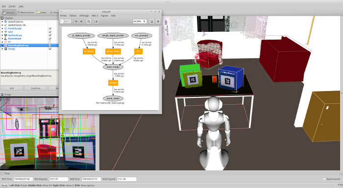
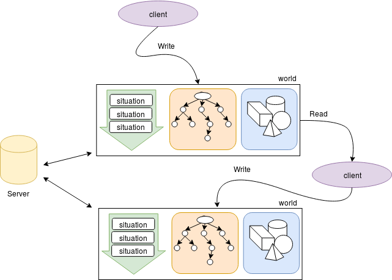

This ROS package contains the core components of **Underworlds** as a *nodelet based architecture* to benefit from zero-copy pointer passing through topics for nodelets. A Python implementation is provided for clients in order to communicate with the server, but will not benefit from this functionality.

## Introduction



**Underworlds** is a distributed and lightweight framework that aims at *sharing between clients parallel models of the physical world surrounding a robot*.

The clients can be geometric reasoners (that compute topological relations between objects), motion planner, event monitors, viewers... any software that need to access a geometric (based on 3D meshes/voxels) and/or temporal (based on events) view of the world.

One of the main specific feature of **Underworlds** is the ability to store many parallel worlds: past models of the environment, future models, models with some objects filtered out, models that are physically consistent, etc.

This package provide only the server that distribute and store the data, the data-structure and abstract classes for clients. So it is needed to develop your own clients (support **C++** and **Python**). A set of basic C++ clients are provided in [this package](https://github.com/underworlds-robot/uwds_basic_clients), Python clients in [this one](https://github.com/underworlds-robot/uwds_physics_clients).

### Uncertainty

Uncertainty is stored differently in the scene that in the timeline. In the scene tree it is represented by the node pose with covariance relative to parent. In the timeline the uncertainty of a situation is represented by its confidence. The composition of the poses with uncertainty in the scene tree is handled by the [pose_cov_ops package](https://wiki.ros.org/pose_cov_ops) used in the scene class.

### Worlds data structure

The **Underworlds** data-structure is composed by a set of worlds, each world have its own timeline and its own scene tree. Meshes are centrally stored and distributed on-demand to the clients.



In a user point of view, **Underworlds** can be viewed as a dynamically reconfigurable reasoning pipeline of clients that read/write into worlds. Allowing to design and integrate the reasoners quickly. When reconfiguring the input worlds of a client, the worlds are fetched with ROS services to avoid any previous missing data, then the client subscribe to the changes that are distributed over the network through topics and update its local data-structure.

### Installation instructions

Note : A Docker is available [here](https://github.com/underworlds-robot/uwds_dockerfile)

First install the dependencies with :
```
sudo apt-get install assimp-utils ros-kinetic-pose-cov-ops
sudo pip install pygraphviz uuid
```
Then clone and build the catkin package :
```
cd catkin_ws/src
git clone https://github.com/underworlds-robot/uwds_msgs.git
git clone https://github.com/underworlds-robot/uwds.git
cd ..
catkin build uwds
source devel/setup.bash
```

### Launch instruction

To launch the server use :
```
roslaunch uwds uwds_server.launch
```

### Introspection tools

This package come with simple introspection tools.
In order to visualize the clients topology, use the commands below :
```
rosrun uwds view_topology.py
evince topology.pdf
```

If you want to inspect the scene tree of a world use the command :
```
rosrun uwds view_scene.py [world]
evince scene.pdf
```

The data is also accessible from the ROS services :
* `uwds/get_scene`
* `uwds/get_timeline`
* `uwds/get_mesh`
* `uwds/get_topology`

### Record & replay

To record and replay with rosbag, record the topic `uwds/changes` (before launching stuff to avoid missing data) :

```
rosbag record --lz4 -o example uwds/changes
```

### Build documentation
Use the following command :

`roscd uwds && rosdoc_lite . `

Then open the file `./doc/html/index.html` with your favorite application.

### References

[UNDERWORLDS : Cascading Situation Assessment for Robots](https://academia.skadge.org/publis/lemaignan2018underworlds.pdf)
